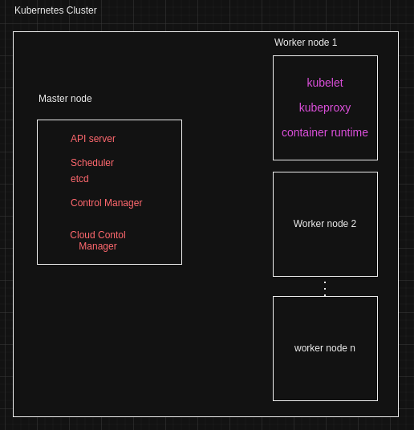

==============================================
Kubernetes have master and worker artitecture.
==============================================

Components in worker node:
==========================

Container runtimes: 
==================
In k8s,we can use any container runtime,which will support k8s infra.we can setup the k8s without docker by using other container runtime,container runtime required to create and manage the containers.

Container runtimes are
       1.containerd
       2.cri-o

kubelet: 
========
kubelet in worker node is responisble keep on watching pod running or not. If pod not running inform to master node

kubeproxy:
=========
kubeproxy is responsible for providing networking,handling load balancing.kubeproxy uses the ip tables in worker node to assgin the ip .As in docker we have docker0 network interface and brige network like that

why we need if worker node doing the all above tasks?
=====================================================

Any enterprise tool have the standards,clutering also one of standard,To manage cluster need core component.that is api server in k8s. In furure if we want implement advanced sso(single sign on user),identity provider configuratin etc 
Master node will decide 
 1)where we need to deploy the application,which worker node have resource,
 2)action will be taken from master when kubelet info pod not running

Components in master node:
==========================

API server:
===========
API server responsible for taking the request from user, informing to master node and give the respective output to user about the request

Scheduler:
==========
Scheduler is resposible for scheduling the pod on which worker node or which worker node need to use to schedule pod based resource available in worker node or labels in worker node

etcd:
=====
etcd is basically key vaule store component,entire cluster information stored in etcd as key vaule pair.if want restore the cluster,etcd is very important.

Control manager:
================
is responsible to ensure that all controllers are  runnning or not. Let assume you deploy application,i have to increase the pods,you will change the replicas into 5,there is conttoller called resplica set controller will create and ensure 5 pods up and running.

Controllers are:
Replica set controller etc

if you are running k8s on on-premise,cloud control manager not required.

Cloud Control manager:
======================
k8s can run on cloud platforms. That are EKS(Elastic Kubernetes service),AKS.
If there is request from user to create storage or load balancer etc ,k8s have to understand underlying cloud platform and convert request into api request which cloude platform can understand and do the task.
This are all done from cloud control manager.

Cloud control manager is open source,if any new cloud provider come,write the logic to support k8s on new cloud and raise request.

Ex:
if we create the service with service type as Load Balancer,k8s need to make communication to get the external ip from cloud provider.
This is all taken care from Cloud Contol Manger 

